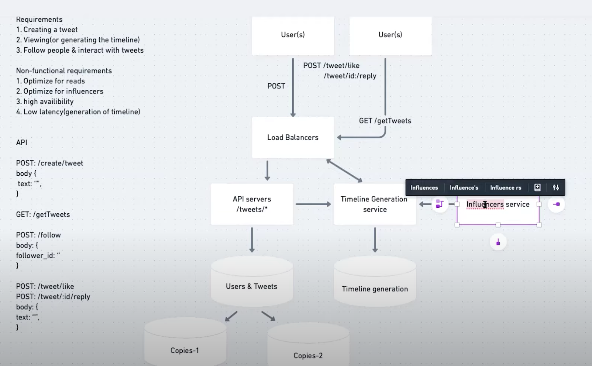

TODO:
1. SOAP b.s. REST v.s. RPC


requirements: 
1. tweetx -> 140 words, 
2. follow and receive tweets, 
3. follows/unfollow users 
4. * tweets: phone, video, text
5. tweets: like - favorite
6. * timeline: service create/display users timeline consist of top tweets from all the ppl uthe user follows.

system requirements
1. available
2. performant, when generate timeline, low latency, 200ms
3. consisitency can take a hit, if a user cannot see a tweet from follow, it's fine. 

additional:
1. search
2. reply
3. trending topics, current hot topic,
4. tag other users, 
5. tweet notification
6. follow suggestion
7. moments 


## Estimation
1. object count
   a. user, total/DAU: 1B/200M
   b. follow: 200 to follow
   c. tweet: 200M * 0.5 -> 100M 
   d. likes count: 200M * 5 -> 1B 
   e. **page view**: 200M DAU * (20 tweets(per page) * (2(timeline) + 5(users)))
2. Storage: 

   a. tweet: 140 * 2byte + 30 byte(meta, timestamp, like ID, user ID)
   b. text: 100 M * (280 + 30) -> 30 GB /day
   c. video, photo: 100M/5 * 200KB + 100M/10 * 2MB -> 24TB/day
3. Bandwidth:
   a. ingress: 24TB/day -> 24Tb/86400 -> 280MB
   b. egress: rendering for page: 
      text: 28B page * 280 Byte / 86400 
      photo: 28B page * 200KB / 86400
      video: 28B page * 2MB / 86400

## System API


tweet(user_id, twitter_content, photo_video_storage_addr, meta_location, meta_time, meta_ )
```
tweet(api_dev_key, tweet_data, tweet_location, user_location, media_ids)
```
api_dev_key (string):: API developer key, -> throttle based on allocated quota


There is a user rate limit of 200 requests per 15 minutes for the POST method. The DELETE method has a rate limit of 50 requests per 15 minutes. Additionally, there is a limit of 300 requests per 3 hours, including Tweets created with either manage Tweets or manage Retweets. 
from: https://developer.twitter.com/en/docs/twitter-api/tweets/manage-tweets/introduction

tweet_data(string): 140 chars
tweet_location(string): geohash? 
user_location(string): 
media_ids(number[]): corrresponding photo and videos are uploaded separately.

return: 
1. success: URL to access the tweet
2. fail: HTTP error, timeout,

## High Level System

QPS: 
write tweet: 100M / 86400s -> 1150 QPS
read page: 28B / 86400s -> 325k QPS

through out the day: 
1. global: -> evenly
2. peak time: -> 2 times, 

-> read heavily!
-> LB + multiple server -> traffic distributions


## DB Schema: 

- user: 
  - user_id
  - **user name**
  - **user email**
  - location
  - following [user_id]
  - **data of birth**
  - **created time**
  - **last login time**

- tweet:
  - tweet_id
  - user_id
  - meta_timestamp
  - meta_location
  - data
  - media
  - **num of favorite**

- user follow
  - follower: userID1
  - following: userID2

- Favorite
  -  tweet id
  -  user id
  -  time

SQL v.s. NoSQL: 


# Data Sharding


# Cache
1. replacement policy
2. intelligent cache? 20% tweets generating 8-% read traffic -> cache 20% cache
3. 100M tweets per day, 30GB new data -> cache three days: 100GB 
timeline like: LL or ringbuffer, 

# timeline generation


```
getUserFeed(api_dev_key, user_id, since_id, count, max_id, exclude_replies)
```
### feed generation:
Jane - user
1. retrieve IDs of all users/entities that Jane follows
2. Retrieve lastest,most populat or relevant posts for thoses IDs, -> Potentially shown in Jane's feed
3. Rank posts -> current feed
4. store the feed in the cache, and only store the top posts(20) to be rendered on Jane's feed
5. on front-end, infinitely fetching

Notification:
if new item comes, add to cache and rank again to rerender **periodically**

potential issues:
1. merging large follows user's timeline is time consuming
2. generate timeline when user loads their page, -> high latency
3. live updates:  -> all followers -> using pre-generate to solve?
   

Offline generation for newsfeed:
1. timeline not compiled on load, but on a regular basis and returned to users whenever they request for it.

new feed data generated from time onwards, 
key: userId
valid: 
```java
Struct {
    LinkedHashMap<FeedItemID, FeedItem> feedItems;
    DateTime lastGenerated;
}
```

How many feed items should stored in mem for a user's feed?
depends on user access pattern:
user usually browser 200 items, -> store items, 500 items -> store 500 items. 


### Feed Publishing


Fan-out: process of pushing a post to all the followers

Push: fanout-on-write
1. pros: fetching feed don't need to go through friends list and get feeds for each of them; reduce the read operation -> Long Poll to maintain a connection with server to receive update
2. Cons: if millions of followers, need to push updates to all ppl. 

Pull: fanout-on-load:
1. involves keeping all recent feed data in mem -> user can pull it from server when needed
2. pull feed data on a regular basis or manually whenever they need it
3. cons: new data not shown until Pull Request; result in empty response if no new data


Hybrid:
1. only push data for those users who have a few hundred (or thousand) followers
2. For celebrity users, we can let the followers pull the updates. Since the push operation can be extremely costly for users who have a lot of friends or followers, by disabling fanout for them, we can save a huge number of resources.
, 
a combination of ‘**push to notify**’ and ‘**pull for serving**’ end-users is a great way to go. Purely a push or pull model is less versatile.


Consider for mobile device
1. page size
2. use "Pull to Refresh", save data by avoid receiving push data


LB: -> consider the scale of system,  distribuetd system,  thousands of server serving Miliions of users, 
how to distribute loads to N servers:
1. simple: RR, consistant hashing + RR, geographically US->US/Asia->DC in Asian 
API server -> hanlde endpoints, 

Main two entities: users & Tweets, DB details later on, TODO

generation of tweets: 
1. BF: tweets table for given users, query scan all users, downside: as the user grow, the read slow
   optimize for read/view, keep the latency low, pre-computation for timeline, -> as tweets, 

Timeline Generation Service: 
1. generate timeline for some active users,(pre-calculate)
2. // 

Download: for influencers
1. redundant in nature, 
2. high bar of users, 
3. don't update timeline for ppl of there
4. while geneting the timeline for the user itself, at runtime, geting the influencers's timeline on the fly. 

different kinds of users: high-active, less-active, influencer 
hybrid approach: pushing content to non-active users would be a waste, 

High availbility: replication, multiple DB, replica of server, master/slave, -> k
   some goes down, have the backup copies for store. 
80-20 theory:
1. timeline generation: active users bubble up to top of the cache
2. cache/storage: influencers



# Search


### Constraints
user: 1.5B users -> 800M DAU
tweets: 400M per day
size of twitter: 300 bytes;
tweets search: 500M per day 
search query: multiple words with AND/OR

storage: 
400M * 300B -> 120GB /day
-> 120GB / 86400s = 1.38MB/s

### Search API

Search API has very common pattern, like 
```
{
  "query": string,
  "pageSize": integer,
  "pageToken": string
   "sort": integer, Optional sort mode: Latest first (0 - default), Best matched (1), Most liked (2)."
}
```
ref: https://developers.google.com/shopping-content/reference/rest/v2.1/reports/search?apix_params=%7B%22merchantId%22%3A12354134%2C%22resource%22%3A%7B%22query%22%3A%22Ball%22%2C%22pageSize%22%3A5%7D%7D#request-body


### High Level

1. Store tweets in DB
2. build index that can keep track of which word appears in which tweet -> quickly find tweets that the users are trying to search for.

#### Storage Design:

120GB per day -> 5yrs: 120GB * 365 * 5 = 200TB
1. never want to more than 80% full at any time -> need 250TB
2. keep extra copy for **fault tolerance**: 500TB
modern server: 4TB of data


TPS: tweets-per-second peak: 33k TPS
2 Billion search queries per day
API query and user query

archive search on SSD


Analyzer/Partitioner: 
1. Pre-process tweets for indexing'
2. analyzing token
3. geo-encoding & url ex
4. hash 

1. remove stopword
2. stemming -> root word

ingester -> at least 3 servers -> highly availoable, 
 


TODO
1. Data storage: 

2. Media storage:


